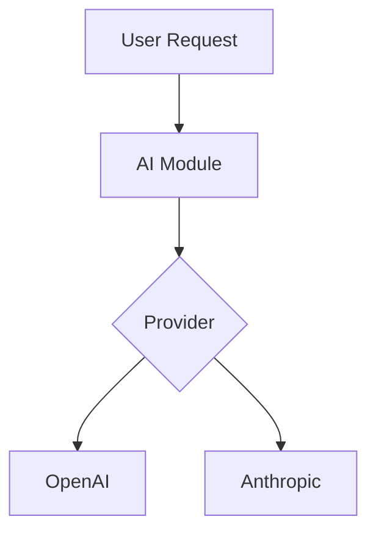

# Documentation (How To)

## Where do I find this documentation
In the Gitlab [repository](https://git.drupalcode.org/project/ai) there is a docs repository. All documentation you see on this page has been built from that.

This means that if you want an offline version of this documentation, this is where you can find it.

## How do I change this documentation
You can simply create an issue, under the [AI Issue queue](https://www.drupal.org/project/issues/ai?categories=All). Then you do a MR with your changes and if they make sense we will merge them and they will show up.

For exact instructions see [Contribute Documentation](../contribute/documentation.md).

## How do I test the changes locally
The documentation uses `mkdocs` and the `material` theme, so you can install with:

```
pip install mkdocs mike mkdocs-material mkdocs-include-markdown-plugin
```

Then you can run `mkdocs serve` in the root directory of the AI module and it will be available under `http://localhost:8000` by default.

## My changes only apply for specific versions
Just make the MR to the latest version it applies to, and then you can tag the issue as "Backport to version x.x.x" and the maintainer that merges it will make sure it shows up on all the different documentations.

## What should go into this documentation
In general it's quite broad - of course anything that affects AI and its submodules, but also big stroke documentation for Providers and AI Agents.

If you contribute to a Provider and want to promote it or write installation instructions, feel free to push it under the providers directory.

## Best practices for images and diagrams

To keep the repository as lean as possible and ensure easy contributions for everyone (especially those in countries with limited internet bandwidth), we have specific guidelines for images and diagrams.

### Images

**Do not store images directly in the repository.** Instead, follow these steps:

1. **Host images externally**: All images should be stored on the [GitLab Wiki for the AI project](https://git.drupalcode.org/project/ai/-/wikis/). Since it is on the same parent domain, hotlinking is possible and preferred.
2. **Use absolute URLs**: Link to your images using their full URL from the GitLab wiki.
3. **Avoid relative paths**: Never use relative paths to image files within the repository.

### Diagrams and Charts

Instead of using static images for diagrams or charts, we use **Mermaid**. Mermaid allows you to create diagrams using text-based definitions which are:

- **Versionable**: Changes can be tracked via Git.
- **Lightweight**: No heavy binary files in the repository.
- **Easy to contribute**: Anyone can update a diagram directly in the Markdown file without needing image editing tools.

Example of a Mermaid diagram:




## How do you switch the default version (for Maintainers)
This can only be done by maintainers that have the right to push to the repo. When you have decided that we for instance have a stable release or near stable release of a version and want to make that the default when you visit https://project.pages.drupalcode.org/ai/ these are the following things you need to do.

In this case we do 3.1.x for instance.

1. Get mkdocs and mike - `pip install mike mkdocs mkdocs-material`
2. Checkout that version in git - `git checkout 3.1.x`
3. Change in mkdocs.yml the canonical_version, this is for SEO reasons. Make sure to push this also.
4. Run `mike alias 3.1.x latest -u` to set 3.1.x to the latest.
5. Run `mike deploy 3.1.x --push` to push the alias changes.
